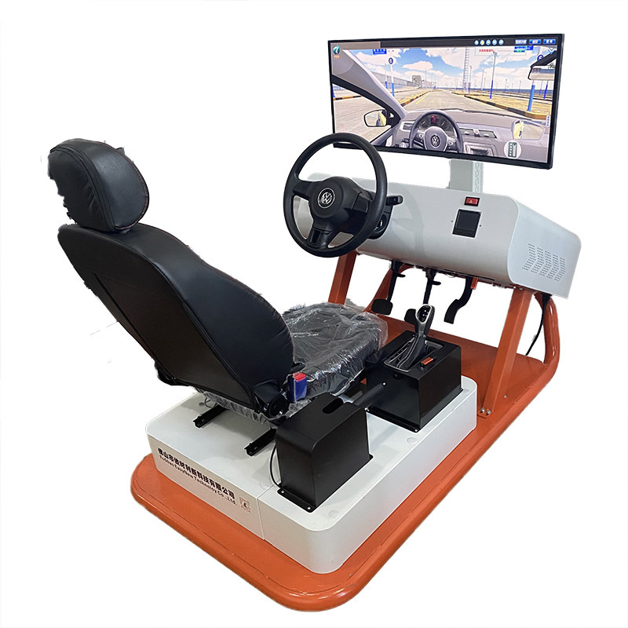

## Simulador de Vehículos


Se solicita modelar los componentes necesarios para desarrollar una funcionalidad simple de un software de simulación de vehículos.

Los vehículos tienen como atributos:

- Cantidad de combustible (en litros).
- Kilometraje (en kilómetros recorridos).
- Consumo (en kilómetros por litro).
- Velocidad máxima (en km/h).
- Tipo de conducción.

## Tipos de conducción

Por el momento solo hay 3 tipos de conducción pero existe una interface definida que nos permitiría agregar más si fuera necesario. Cada tipo de conducción afecta el consumo y la velocidad máxima del auto de la siguiente manera:

- Ecológica: consumo de 16 km/litro y velocidad máxima de 120 km/h.
- Estándar: consumo de 10 km/litro y velocidad máxima de 150 km/h.
- Deportiva: consumo de 5 km/litro y velocidad máxima de 200 km/h.

El vehículo puede cambiar el tipo de conducción avanzandola o retrocediendola de acuerdo a las siguientes reglas:

| Tipo de Conducción | anterior  | siguiente |
| ------------------ | --------- | --------- |
| Ecológica          | -         | Estandar  |
| Estándar           | Ecológica | Deportiva |
| Deportiva          | Estándar  | -         |

### Interface de los tipos de conduccion

La inteface definida para que pueda agregarse nuevos tipos de conducción es la siguiente:

```
public interface TipoConduccion {

    Double consumo();
    Double velocidadMaxima();
    TipoConduccion siguiente();
    TipoConduccion anterior()

}
```

## Avance del Vehículo

Los vehículos del simulador siempre arrancan en modo ecológico y con 0 kilometros, pero se les indica la cantidad de combustible en la creación.

La simulación a modelar es **desplazar** indicandole una cantidad de kilómetros a recorrer. Al desplazarse, deben:

- Restar del combustible la cantidad consumida para recorrer la distancia solicitada.
- Sumar los kilómetros recorridos al kilometraje total.
- Si el combustible no es suficiente para recorrer la distancia solicitada, el vehículo se desplazará hasta donde le alcance el combustible, actualizará sus atributos correspondientes (combustible y kilometraje) e informará con un error que no pudo completar el recorrido solicitado con el siguiente mensaje: "Combustible insuficiente, solo pude recorrer X del total de Y kilometros.";

Para lanzar un excepción de manera simple y no chequeda pueden hacer

```
    throw new RuntimeException("Combustible insuficiente ...")
```

## Test

### Vehículo retrocediendo y avanzando tipos de conducción debería retornar correctamente la velocidad

1. Crear un vehículo con 3 Litros de combustible.
2. Retroceder el tipo de conducción una vez.
3. Avanzar el tipo de conduccion 3 veces.
4. Retroceder el tipo de conducción una vez.
5. Verificar que la velocidad máxima del auto es de 150 km/h.

### Vehículo en conducción estándar debería avanzar correctamente y reducir el combustible

1. Crear un vehículo con 25 Litros de combustible.
2. Cambiar una vez el tipo de conducción.
3. Desplazar 200 kilómetros.
4. Verificar que el auto queden con 200.0 kilomentros y con 5.0 litros de combustible.

### Vehículo en conducción deportiva debería lanzar una excepción si no hay suficiente combustible

1. Crear un vehículo con 13 Litros de combustible.
2. Cambiar dos veces el tipo de conducción.
3. Desplazar 75 kilómetros.
4. Verificar que se produjo la RuntimeException "Combustible insuficiente, solo pude recorrer 65 del total de 75.0 kilometros." y que el auto queden con 65.0 kilomentros y con 0.0 litros de combustible.

### Vehículo creado con combustible negativo debería lanzar una excepción

1. Crear un vehículo con -10 Litros de combustible.
2. Verificar que se produjo la RuntimeException "La cantidad de combustible no puede ser negativa.".

### Verificar que cada vez que se avance de tipo de conducción la velocidad máxima es mayor

1. Crear un vehículo con 10 Litros de combustible.
2. Guardar en una variable el valor de la velocidad máxima ecológica.
3. Avanzar el tipo de conducción.
4. Guardar en una variable el valor de la velocidad máxima estándar.
5. Avanzar el tipo de conducción.
6. Guardar en una variable el valor de la velocidad máxima deportiva.
7. Verificar que la velocidad máxima ecológica es menor que la velocidad máxima estándar.
8. Verificar que la velocidad máxima estándar no es mayor que la velocidad máxima deportiva.
9. Verificar que la velocidad máxima estándar no es igual que la velocidad máxima deportiva.

Estas últimas 3 verficaciones son para que se pueda dar uso a los diferentes tipos de assert (assertTrue, assertFalse, assertNotEquals)
